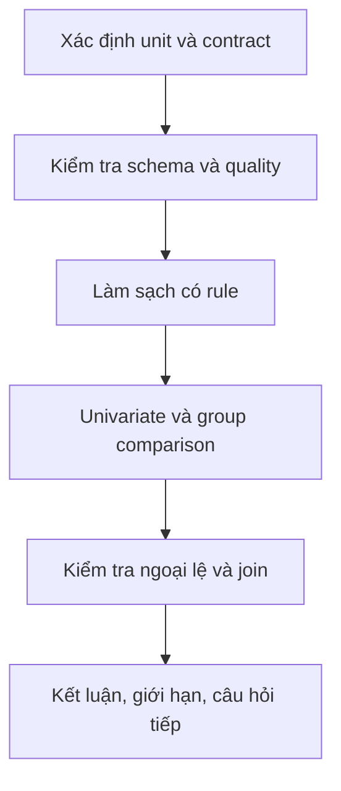

# Kiến thức Tuần 1 — NumPy, Pandas, EDA và testing

## 1. Tư duy chính: dữ liệu cũng là một contract

Một bảng không chỉ là tập hợp các ô. Nó có contract:

- Mỗi dòng đại diện cho cái gì?
- Khóa nào xác định duy nhất một dòng?
- Mỗi cột có kiểu dữ liệu, đơn vị và miền giá trị nào?
- Giá trị nào được phép thiếu?
- Một giá trị “hợp lệ về kiểu” có thể vẫn sai về nghiệp vụ không?

Trong bộ dữ liệu tuần này, mỗi dòng phải đại diện cho một đơn hàng. `order_id` là khóa duy nhất. `quantity` phải là số nguyên dương, `unit_price` phải dương và `discount_pct` phải nằm trong `[0, 100]`.

Nếu chưa mô tả contract, thao tác “làm sạch” rất dễ biến thành sửa dữ liệu tùy ý.

## 2. NumPy ndarray

### 2.1. Bốn thuộc tính phải kiểm tra

```python
import numpy as np

x = np.array([[1, 2, 3], [4, 5, 6]], dtype=np.float64)

print(x.shape)  # (2, 3)
print(x.ndim)   # 2
print(x.dtype)  # float64
print(x.size)   # 6
```

- `shape`: kích thước theo từng trục.
- `ndim`: số trục.
- `dtype`: kiểu của mọi phần tử.
- `size`: tổng số phần tử.

Trong ML, rất nhiều lỗi là lỗi shape nhưng biểu hiện ở một layer hoặc phép nhân xa nơi tạo dữ liệu.

### 2.2. Axis

Với mảng shape `(n_rows, n_features)`:

- `axis=0`: giảm theo chiều dòng, cho một kết quả trên mỗi cột.
- `axis=1`: giảm theo chiều cột, cho một kết quả trên mỗi dòng.

```python
x.mean(axis=0)  # mean của từng feature
x.mean(axis=1)  # mean của từng sample
```

Luôn viết shape kỳ vọng trước khi chạy phép toán.

### 2.3. Indexing, slicing và boolean mask

```python
prices = np.array([10.0, 25.0, 8.0, 42.0])

prices[0]             # scalar
prices[1:3]           # slice
prices[prices >= 20]  # boolean mask
```

Một slice cơ bản thường là view. Sửa view có thể ảnh hưởng mảng gốc:

```python
x = np.arange(6)
view = x[1:4]
view[0] = 999
assert x[1] == 999
```

Khi cần dữ liệu độc lập, dùng `.copy()` có chủ đích.

### 2.4. Vectorization

Loop Python:

```python
revenue = []
for q, p in zip(quantity, unit_price):
    revenue.append(q * p)
```

Vectorized:

```python
revenue = quantity * unit_price
```

Vectorization thường ngắn hơn, ít điểm lỗi hơn và chuyển vòng lặp xuống implementation tối ưu của NumPy. Tuy nhiên, không được đánh đổi tính đúng đắn chỉ để loại loop.

### 2.5. Broadcasting

Hai chiều tương thích khi so từ phải sang trái và với mỗi cặp chiều:

- Hai kích thước bằng nhau; hoặc
- Một trong hai bằng `1`; hoặc
- Một mảng không có chiều đó.

Ví dụ chuẩn hóa từng cột:

```python
x = np.array([[1.0, 10.0], [3.0, 30.0], [5.0, 50.0]])  # (3, 2)
mean = x.mean(axis=0)                                    # (2,)
std = x.std(axis=0)                                      # (2,)
z = (x - mean) / std                                     # (3, 2)
```

`mean` và `std` có shape `(2,)`, tương thích với chiều cuối của `x` là `2`.

Lỗi thường gặp:

```python
row_mean = x.mean(axis=1)  # (3,)
x - row_mean               # ValueError vì (3, 2) và (3,) không tương thích
```

Cách đúng nếu muốn trừ mean của từng dòng:

```python
row_mean = x.mean(axis=1, keepdims=True)  # (3, 1)
x - row_mean                              # (3, 2)
```

### 2.6. Dtype và missing value

- `int64` không biểu diễn `NaN` theo cách NumPy truyền thống.
- Trộn số và chuỗi thường khiến cột thành `object`/string.
- Phép chia số nguyên tạo số thực.
- Chuyển kiểu có thể mất thông tin.

Không sửa bằng `astype(float)` một cách mù quáng. Với dữ liệu bên ngoài, ưu tiên parse có kiểm soát:

```python
numeric = pd.to_numeric(series, errors="coerce")
invalid_mask = numeric.isna() & series.notna()
```

## 3. Pandas DataFrame

### 3.1. Nạp và kiểm tra ban đầu

```python
import pandas as pd

df = pd.read_csv("data/customer_orders_raw.csv")

print(df.shape)
print(df.head())
print(df.info())
print(df.isna().sum())
print(df.duplicated().sum())
```

Checklist đầu tiên:

1. Số dòng/cột có hợp lý không?
2. Khóa có unique không?
3. Cột số có bị đọc thành chuỗi không?
4. Missingness tập trung ở cột nào?
5. Giá trị category có khác nhau chỉ vì hoa/thường/khoảng trắng không?
6. Min/max có vi phạm rule không?

### 3.2. Lựa chọn dữ liệu

```python
df["Category"]
df[["Category", "Quantity"]]
df.loc[df["Quantity"] > 2, ["Product", "Quantity"]]
df.iloc[:5, :3]
```

- Dùng `loc` với label và condition.
- Dùng `iloc` với vị trí số nguyên.
- Tránh chained assignment khó đoán; tạo `.copy()` trước khi sửa subset.

### 3.3. Chuẩn hóa chuỗi

```python
category = (
    df["Category"]
    .astype("string")
    .str.strip()
    .str.lower()
)
```

Chuẩn hóa phải theo contract. Không nên tự động sửa typo bằng heuristic nếu nguy cơ ghép sai nhóm cao.

### 3.4. Parse kiểu dữ liệu

```python
quantity = pd.to_numeric(df["Quantity"], errors="coerce")
dates = pd.to_datetime(df["Order Date"], errors="coerce")
```

`errors="coerce"` biến giá trị không parse được thành missing. Đây không phải là kết thúc: phải đếm, điều tra và quyết định xử lý các giá trị bị coerce.

Ngày lẫn định dạng đặc biệt nguy hiểm. Một chuỗi có thể parse thành ngày khác mà không báo lỗi. Giải pháp tốt hơn là:

1. Xác định các format hợp lệ trong contract.
2. Parse format cấu trúc chặt trước.
3. Parse phần còn lại theo rule đã công bố.
4. Test các ngày mơ hồ và ngày không hợp lệ.

### 3.5. Missing, duplicate và invalid không giống nhau

- **Missing:** ô không có giá trị.
- **Duplicate:** hai dòng hoặc hai khóa lặp lại.
- **Invalid:** có giá trị nhưng vi phạm kiểu/miền/business rule.
- **Inconsistent:** cùng một nghĩa nhưng biểu diễn khác nhau.

Mỗi loại cần policy riêng. Ví dụ, discount thiếu có thể mặc định là `0` nếu nghiệp vụ xác nhận; `customer_id` thiếu không thể tự bịa.

### 3.6. GroupBy

```python
summary = (
    orders.groupby("category", as_index=False)
    .agg(
        orders=("order_id", "nunique"),
        units=("quantity", "sum"),
        net_revenue=("net_revenue", "sum"),
    )
    .sort_values("net_revenue", ascending=False)
)
```

Trước khi tin kết quả, xác minh:

- Category đã canonical chưa?
- Aggregation có làm rơi missing group không?
- `count`, `size` và `nunique` có ý nghĩa khác nhau.
- Doanh thu cần dùng gross hay net?

### 3.7. Merge và cardinality

```python
enriched = orders.merge(
    customers,
    on="customer_id",
    how="left",
    validate="many_to_one",
    indicator=True,
)
```

`validate="many_to_one"` biến giả định cardinality thành kiểm tra thực thi. `indicator=True` giúp đếm key không match.

Không kiểm tra cardinality có thể làm số dòng tăng ngoài ý muốn và thổi phồng metric.

## 4. EDA có mục tiêu

EDA tốt bắt đầu bằng câu hỏi. Với dữ liệu tuần này:

1. Dữ liệu có đáng tin để tính doanh thu không?
2. Category nào đóng góp net revenue lớn nhất?
3. Region nào có nhiều đơn và doanh thu cao?
4. Discount ảnh hưởng gross-to-net gap thế nào?
5. Có customer key nào không match với master data?

Quy trình:



Mỗi biểu đồ phải gắn với một câu hỏi và một kết luận. “Biểu đồ trông đẹp” không phải insight.

## 5. Matplotlib tối thiểu cần biết

```python
import matplotlib.pyplot as plt

fig, ax = plt.subplots(figsize=(8, 4))
ax.bar(summary["category"], summary["net_revenue"])
ax.set(
    title="Net revenue by category",
    xlabel="Category",
    ylabel="Net revenue (currency units)",
)
fig.tight_layout()
fig.savefig("outputs/figures/revenue_by_category.png", dpi=150)
```

Checklist biểu đồ:

- Loại biểu đồ phù hợp với câu hỏi.
- Trục có nhãn và đơn vị.
- Category được sắp theo logic.
- Không cắt trục gây hiểu sai.
- Màu không mang ý nghĩa giả.
- Có câu kết luận bằng văn bản.

## 6. Pure transformation và testing

Transformation tốt nhận input và trả output mới:

```python
def clean_orders(raw: pd.DataFrame) -> pd.DataFrame:
    df = raw.copy(deep=True)
    # transformations
    return df
```

Lợi ích:

- Dễ test.
- Không phụ thuộc state notebook.
- Có thể chạy lại.
- Dễ ghép vào pipeline sau này.

Các test quan trọng hơn kiểm tra một con số cụ thể:

```python
assert cleaned["order_id"].is_unique
assert (cleaned["quantity"] > 0).all()
assert cleaned["discount_pct"].between(0, 100).all()
assert not cleaned[required].isna().any().any()
```

Test tốt mô tả invariant. Khi dataset thay đổi, invariant vẫn có ý nghĩa.

Ngoài ra cần test:

- Không mutate input.
- Thiếu cột bắt buộc phải fail rõ ràng.
- Revenue feature đúng công thức.
- Output có schema/dtype mong đợi.
- Kết quả có thứ tự ổn định nếu việc so sánh cần deterministic.

## 7. Môi trường và tái tạo

Virtual environment cô lập dependency theo dự án. Quy trình cơ bản:

```bash
python3.11 -m venv .venv
source .venv/bin/activate
python -m pip install -r requirements.txt
python -m pip freeze > requirements.lock.txt
```

`requirements.txt` mô tả dependency cần dùng; lock file ghi lại phiên bản đã xác nhận chạy được. Không commit `.venv/` vì môi trường phải tái tạo được, không phải sao chép nguyên thư mục.

## 8. Git workflow tối thiểu

Ba trạng thái cần nhớ: modified → staged → committed.

```bash
git status
git add notebooks/01-numpy-vectorization.ipynb
git commit -m "lab: complete numpy vectorization exercises"
```

Commit theo một thay đổi có ý nghĩa. Gợi ý cho Tuần 1:

1. `chore: initialize week 1 environment`
2. `lab: complete numpy and pandas labs`
3. `feat: implement tested order cleaning pipeline`
4. `docs: add EDA report and retrospective`

## 9. Lỗi thường gặp

| Lỗi                             | Vì sao nguy hiểm                              | Cách kiểm tra                          |
| ------------------------------- | --------------------------------------------- | -------------------------------------- |
| Không xem `dtype`               | Phép toán có thể nối chuỗi hoặc fail muộn     | `df.dtypes`, `pd.to_numeric`           |
| Dùng `apply` cho mọi thứ        | Chậm và che mất phép toán vectorized đơn giản | Tìm toán tử/ufunc/string methods trước |
| `dropna()` toàn bảng            | Xóa dữ liệu không có lý do theo từng cột      | Viết policy cho từng field             |
| Parse ngày tự động hoàn toàn    | Ngày mơ hồ có thể bị hiểu sai mà không lỗi    | Parse format chặt và test case         |
| Merge không `validate`          | Có thể nhân bản dòng                          | Kiểm tra cardinality và row count      |
| Sửa DataFrame input tại chỗ     | Test phụ thuộc thứ tự chạy                    | Copy input, return output mới          |
| Chỉ kiểm tra output mẫu         | Không bảo vệ invariant                        | Test uniqueness, domain, schema        |
| Notebook chạy từng cell rời rạc | Ẩn dependency state                           | Restart kernel và Run All              |

## 10. Câu hỏi tự kiểm tra

1. Mảng `(100, 5)` trừ vector `(5,)` hoạt động vì sao?
2. Vì sao `(100, 5)` trừ vector `(100,)` không hoạt động?
3. Khác nhau giữa missing, invalid và inconsistent là gì?
4. Vì sao `merge(validate="many_to_one")` có giá trị?
5. Vì sao transformation nên không mutate input?
6. `count`, `size`, `nunique` khác nhau trong trường hợp nào?
7. Khi nào xóa một hàng là quyết định hợp lệ?
8. Một biểu đồ cần thêm thông tin gì để trở thành bằng chứng?
