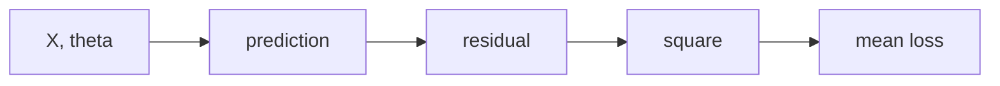

# Kiến thức Tuần 2 — Đại số tuyến tính, gradient và Linear Regression

## 1. Tại sao ML dùng đại số tuyến tính?

Một model nhận nhiều sample và nhiều feature. Thay vì viết một phương trình cho từng dòng, ta biểu diễn toàn bộ batch bằng matrix:

$$
\hat{\mathbf{y}} = \mathbf{X}\boldsymbol{\theta}
$$

Trong đó:

- $\mathbf{X}$ có shape `(n_samples, n_features_with_bias)`.
- $\boldsymbol{\theta}$ có shape `(n_features_with_bias,)`.
- $\hat{\mathbf{y}}$ có shape `(n_samples,)`.

Đại số tuyến tính giúp biểu diễn model; giải tích giúp biết phải thay đổi tham số theo hướng nào; tối ưu hóa biến hướng đó thành thuật toán học.

## 2. Scalar, vector, matrix và tensor

| Đối tượng | Ví dụ | NumPy shape |
|---|---|---|
| Scalar | nhiệt độ, loss | `()` hoặc Python number |
| Vector | một sample có 5 feature | `(5,)` |
| Matrix | 100 sample × 5 feature | `(100, 5)` |
| Tensor | batch 32 ảnh RGB 64×64 | `(32, 64, 64, 3)` |

Trong tài liệu này, vector là array 1D. NumPy không phân biệt row vector và column vector với shape `(d,)`. Khi cần rõ ràng:

```python
v = np.array([1.0, 2.0, 3.0])
row = v.reshape(1, -1)    # (1, 3)
column = v.reshape(-1, 1) # (3, 1)
```

Không thêm chiều ngẫu nhiên để “sửa” lỗi. Viết shape contract trước.

## 3. Vector operations

### 3.1. Addition và scalar multiplication

Với hai vector cùng shape:

$$
\mathbf{a} + \mathbf{b} = [a_1+b_1, \ldots, a_d+b_d]
$$

```python
a = np.array([1.0, 2.0, 3.0])
b = np.array([4.0, 5.0, 6.0])
a + b
2.0 * a
```

### 3.2. Dot product

$$
\mathbf{a}^\top\mathbf{b} = \sum_{j=1}^{d} a_j b_j
$$

```python
score = a @ b
```

Dot product có ba cách nhìn:

1. Tổng các tích theo feature.
2. Độ tương đồng về hướng và độ lớn.
3. Một weighted sum — chính là lõi của linear model.

Nếu $\theta$ là weights và $x$ là feature vector:

$$
\hat{y} = \theta_0 + \theta_1x_1 + \cdots + \theta_dx_d
$$

Sau khi thêm bias feature `1`, đây là một dot product.

### 3.3. Norm

L2 norm:

$$
\|\mathbf{x}\|_2 = \sqrt{\sum_j x_j^2}
$$

```python
np.linalg.norm(x)
```

Khoảng cách Euclidean:

$$
d(\mathbf{a}, \mathbf{b}) = \|\mathbf{a}-\mathbf{b}\|_2
$$

Norm xuất hiện trong distance, regularization, gradient clipping và convergence checks.

Không nhầm:

- `np.sum(x**2)` là squared L2 norm.
- `np.linalg.norm(x)` là L2 norm.
- MSE là mean squared residual, không phải RMSE.

## 4. Matrix operations

### 4.1. Transpose

Nếu $X$ có shape `(n, d)`, thì $X^T$ có shape `(d, n)`.

```python
X.T
```

Transpose đổi vai trò hàng và cột. Trong gradient của regression, $X^T$ gom residual từ sample space trở về parameter space.

### 4.2. Matrix multiplication

Quy tắc shape:

$$
(m, k) @ (k, n) \rightarrow (m, n)
$$

Hai inner dimensions phải bằng nhau.

```python
A = np.ones((4, 3))
B = np.ones((3, 2))
C = A @ B              # (4, 2)
```

Với matrix-vector:

$$
(n,d) @ (d,) \rightarrow (n,)
$$

Mỗi phần tử output là dot product giữa một row của $X$ và $\theta$.

### 4.3. `*` không phải matrix multiplication

```python
X * Y  # element-wise, cần broadcast-compatible
X @ Y  # matrix product
```

Đây là một lỗi phổ biến khi chuyển từ ký hiệu toán sang NumPy.

## 5. Design matrix và bias

Với ba sample, hai feature:

$$
X =
\begin{bmatrix}
x_{11} & x_{12} \\
x_{21} & x_{22} \\
x_{31} & x_{32}
\end{bmatrix}
$$

Thêm cột bias:

$$
X_b =
\begin{bmatrix}
1 & x_{11} & x_{12} \\
1 & x_{21} & x_{22} \\
1 & x_{31} & x_{32}
\end{bmatrix}
$$

```python
X_bias = np.column_stack([np.ones(X.shape[0]), X])
```

Parameter vector:

$$
\theta = [\theta_0, \theta_1, \theta_2]^T
$$

$\theta_0$ là intercept.

## 6. Linear Regression

Model:

$$
\hat{\mathbf{y}} = X_b\theta
$$

Residual:

$$
\mathbf{r} = \hat{\mathbf{y}} - \mathbf{y}
$$

Mean Squared Error:

$$
J(\theta) = \frac{1}{n}\sum_{i=1}^{n}(\hat{y}_i-y_i)^2
= \frac{1}{n}\|X_b\theta-y\|_2^2
$$

MSE phạt lỗi lớn mạnh hơn do bình phương. Đơn vị của MSE là đơn vị target bình phương; RMSE quay lại đơn vị target.

```python
residual = X_bias @ theta - y
mse = np.mean(residual ** 2)
```

## 7. Derivative: độ dốc cục bộ

Derivative của hàm một biến:

$$
f'(x) = \lim_{h\to 0}\frac{f(x+h)-f(x)}{h}
$$

Ví dụ:

$$
f(x)=x^2 \Rightarrow f'(x)=2x
$$

Ý nghĩa:

- $f'(x)>0$: tăng $x$ một chút làm $f$ tăng.
- $f'(x)<0$: tăng $x$ một chút làm $f$ giảm.
- $f'(x)=0$: điểm phẳng cục bộ; chưa chắc là minimum.

Finite difference là xấp xỉ, không phải định nghĩa implementation của gradient training.

Forward difference:

$$
f'(x) \approx \frac{f(x+\epsilon)-f(x)}{\epsilon}
$$

Central difference thường chính xác hơn:

$$
f'(x) \approx \frac{f(x+\epsilon)-f(x-\epsilon)}{2\epsilon}
$$

## 8. Partial derivative và gradient

Loss phụ thuộc nhiều parameter. Partial derivative giữ các parameter khác cố định:

$$
\frac{\partial J}{\partial \theta_j}
$$

Gradient gom tất cả partial derivatives:

$$
\nabla_\theta J =
\begin{bmatrix}
\partial J/\partial\theta_0 \\
\vdots \\
\partial J/\partial\theta_d
\end{bmatrix}
$$

Gradient trỏ theo hướng tăng nhanh nhất cục bộ. Vì cần giảm loss, gradient descent đi theo hướng âm gradient.

## 9. Chain rule

Linear regression loss là chuỗi phép toán:



Với một sample:

$$
\hat y = x^T\theta,\quad r=\hat y-y,\quad L=r^2
$$

Chain rule:

$$
\frac{\partial L}{\partial\theta}
= \frac{\partial L}{\partial r}
\frac{\partial r}{\partial \hat y}
\frac{\partial \hat y}{\partial\theta}
= 2r \cdot 1 \cdot x
$$

Đây là phiên bản nhỏ của backpropagation.

## 10. Suy ra gradient MSE

Ta có:

$$
J(\theta)=\frac{1}{n}(X_b\theta-y)^T(X_b\theta-y)
$$

Gradient:

$$
\nabla_\theta J(\theta)
= \frac{2}{n}X_b^T(X_b\theta-y)
$$

Shape audit:

| Biểu thức | Shape |
|---|---|
| $X_b$ | `(n, d+1)` |
| $\theta$ | `(d+1,)` |
| $X_b\theta$ | `(n,)` |
| residual | `(n,)` |
| $X_b^T$ | `(d+1, n)` |
| $X_b^T residual$ | `(d+1,)` |
| gradient | `(d+1,)` |

NumPy:

```python
residual = X_bias @ theta - y
gradient = (2.0 / len(y)) * (X_bias.T @ residual)
```

Nếu gradient shape khác theta shape, implementation sai.

## 11. Numerical gradient checking

Analytical gradient nhanh nhưng dễ viết sai. Numerical gradient chậm nhưng hữu ích để kiểm tra.

Với từng parameter $j$:

$$
g_j^{num}=
\frac{J(\theta+\epsilon e_j)-J(\theta-\epsilon e_j)}{2\epsilon}
$$

Relative error:

$$
\text{relative error}=
\frac{\|g^{analytic}-g^{numeric}\|_2}
{\max(1,\|g^{analytic}\|_2+\|g^{numeric}\|_2)}
$$

Trong bài tuần này, yêu cầu `< 1e-6`.

Gradient check workflow:

1. Dùng dataset nhỏ.
2. Dùng parameter ngẫu nhiên, không chỉ zero.
3. Dùng `float64`.
4. Thử vài epsilon như `1e-4`, `1e-5`, `1e-6`.
5. Nếu epsilon quá lớn: truncation error.
6. Nếu epsilon quá nhỏ: floating-point cancellation.

Numerical gradient chỉ dùng để test; không dùng train model lớn vì cần hai lần tính loss cho mỗi parameter.

## 12. Gradient Descent

Update rule:

$$
\theta^{(t+1)}=\theta^{(t)}-\eta\nabla_\theta J(\theta^{(t)})
$$

$\eta$ là learning rate.

Pseudo-code:

```python
theta = initial_theta.copy()
history = [loss(theta)]
for step in range(n_steps):
    theta -= learning_rate * gradient(theta)
    history.append(loss(theta))
```

Luôn copy `initial_theta`; nếu không, hàm có thể mutate input ngoài ý muốn.

## 13. Learning rate

### Quá nhỏ

- Loss giảm nhưng rất chậm.
- Sau số bước cố định, model còn xa optimum.

### Phù hợp

- Loss giảm ổn định.
- Gradient norm tiến về nhỏ.
- Parameter hội tụ.

### Quá lớn

- Loss dao động hoặc tăng.
- Parameter overshoot qua minimum.
- Có thể thành `inf`/`nan`.

Không chọn learning rate dựa trên một final loss duy nhất. Vẽ curve cùng trục log và ghi time/steps-to-threshold.

## 14. Vì sao standardization giúp hội tụ?

Nếu feature có scale rất khác nhau, loss surface có dạng thung lũng dài và hẹp. Một step phù hợp theo hướng này có thể quá lớn hoặc quá nhỏ theo hướng khác.

Standardization:

$$
z_j = \frac{x_j-\mu_j}{\sigma_j}
$$

```python
mean = X.mean(axis=0)
scale = X.std(axis=0)
safe_scale = np.where(scale == 0, 1.0, scale)
X_scaled = (X - mean) / safe_scale
```

Constant feature có standard deviation 0. Dùng scale `1` để tránh chia 0; standardized value sẽ là 0.

Quan trọng về production:

- Fit mean/scale trên training data.
- Lưu mean/scale.
- Apply đúng mean/scale cho dữ liệu mới.
- Không fit lại scaler khi predict.

Tuần 3 sẽ làm rõ train/validation/test leakage; tuần này tập trung vào cơ chế tối ưu.

## 15. Chuyển parameter từ standardized space về raw space

Model trên standardized input:

$$
\hat y = \theta_0^{(z)} + \sum_j \theta_j^{(z)}\frac{x_j-\mu_j}{\sigma_j}
$$

Raw coefficients:

$$
\beta_j = \frac{\theta_j^{(z)}}{\sigma_j}
$$

Raw intercept:

$$
\beta_0 = \theta_0^{(z)} - \sum_j\beta_j\mu_j
$$

Khi report hệ số theo đơn vị nghiệp vụ, dùng raw coefficients.

## 16. Least squares reference

Linear regression có thể giải bằng least squares. Trong code số học, dùng:

```python
theta_lstsq = np.linalg.lstsq(X_bias, y, rcond=None)[0]
```

Tránh mặc định:

```python
np.linalg.inv(X_bias.T @ X_bias) @ X_bias.T @ y
```

Lý do:

- Matrix có thể singular hoặc gần singular.
- Tạo inverse trực tiếp kém ổn định hơn solver/factorization.
- `lstsq` xử lý rank deficiency tốt hơn.

Trong tuần này, `lstsq` là reference để xác nhận gradient descent, không thay thế việc tự cài optimization.

## 17. Loss, RMSE, MAE và R²

Training objective của bài là MSE. Khi báo cáo:

$$
RMSE = \sqrt{MSE}
$$

$$
MAE = \frac{1}{n}\sum_i |\hat y_i-y_i|
$$

$$
R^2 = 1 - \frac{\sum_i(y_i-\hat y_i)^2}{\sum_i(y_i-\bar y)^2}
$$

Không dùng R² để nói model “đúng” về causal effect. Dataset synthetic biết công thức, nhưng dữ liệu thực tế không cho phép suy luận nhân quả chỉ từ regression coefficient.

## 18. Debugging checklist

### Loss không giảm

1. Kiểm tra gradient check.
2. Kiểm tra dấu update: phải trừ gradient.
3. Kiểm tra factor `2/n`.
4. Kiểm tra feature scale.
5. Giảm learning rate.
6. Kiểm tra y/prediction shape để tránh broadcast sai.

### Loss giảm nhưng parameter sai

1. So sánh prediction/loss với `lstsq`.
2. Kiểm tra bias column.
3. Kiểm tra chuyển coefficient từ standardized space.
4. Kiểm tra stopping/steps.

### Loss thành NaN/Inf

1. Kiểm tra input finite.
2. Kiểm tra learning rate.
3. Standardize feature.
4. Theo dõi gradient norm và parameter norm.
5. Raise lỗi sớm thay vì tiếp tục train im lặng.

### Gradient check fail

1. Dùng central difference.
2. Đổi epsilon.
3. Dùng float64.
4. Chọn theta không phải toàn zero.
5. Kiểm tra mean vs sum trong loss/gradient.

## 19. Không cần học quá sâu trong tuần này

Chưa cần chứng minh đầy đủ về vector space, eigen decomposition, SVD hay convex analysis. Cần nắm chắc:

- Shape và matrix multiplication.
- Dot product và norm.
- Derivative, partial derivative, gradient, chain rule.
- Gradient của MSE.
- Gradient checking.
- Learning rate và scaling.

SVD/PCA sẽ quay lại ở Tuần 9.

## 20. Câu hỏi tự kiểm tra

1. Vì sao `X @ theta` tạo một prediction cho mỗi row?
2. Vì sao `X.T @ residual` có cùng số phần tử với theta?
3. Factor `2/n` đến từ đâu?
4. Numerical gradient dùng để train hay test? Vì sao?
5. Learning rate quá lớn biểu hiện thế nào?
6. Vì sao standardization không làm mất khả năng biểu diễn linear model?
7. Cách chuyển standardized coefficients về raw units?
8. Vì sao nên dùng `lstsq` thay vì explicit inverse?
9. MSE và RMSE khác nhau về đơn vị thế nào?
10. Loss giảm có đủ chứng minh gradient đúng không?

